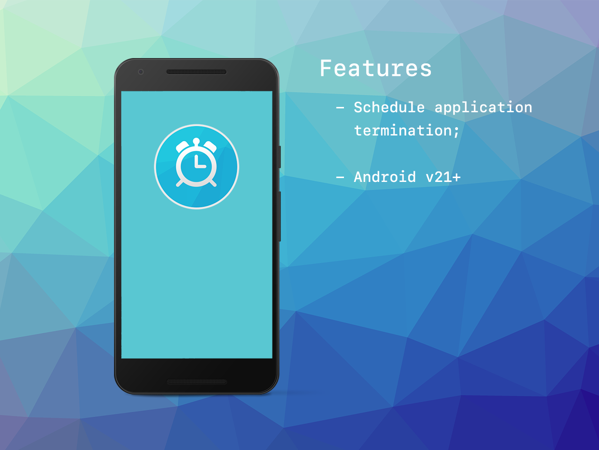

built by [distriqt //](https://airnativeextensions.com) 


# JobScheduler

The [JobScheduler](https://airnativeextensions.com/extension/com.distriqt.JobScheduler) extension 
is an AIR Native Extension that allows you to schedule particular tasks.


This extension was developed for usage in resolution of the Adobe AIR Android ANR issue, as discussed:

- https://github.com/Gamua/Adobe-Runtime-Support/issues/29


### Features

- Schedule application termination;
- Cancel application termination;


## Documentation

Latest documentation can be found in the [wiki](https://github.com/distriqt/ANE-JobScheduler/wiki)
along with the [asdocs](https://distriqt.github.io/ANE-JobScheduler/asdocs). 

Quick Example: 

```actionscript
JobScheduler.instance.scheduleTermination( 2000 );
```


## Native Extensions

The highest quality and widest range of Native Extensions for Adobe AIR

With many native extensions available, we are the largest provider of native extensions for AIR developers. 
Our mobile solutions allow developers to fast-forward development and focus on building great games and apps.

[https://airnativeextensions.com](https://airnativeextensions.com)


## Acknowledgements

This extension was made possible with support by:

- TODO



