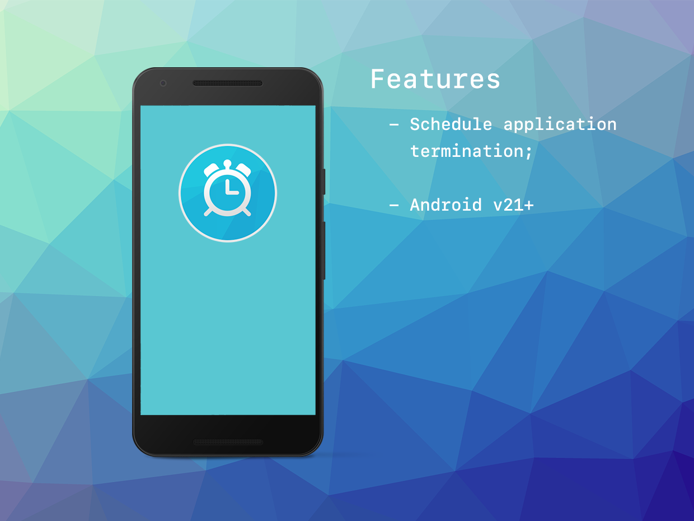

# JobScheduler

The [JobScheduler](https://airnativeextensions.com/extension/com.distriqt.JobScheduler) extension 
is an AIR Native Extension that allows you to schedule particular tasks.


This extension was developed for usage in resolution of the Adobe AIR Android ANR issue, as discussed:

- https://github.com/Gamua/Adobe-Runtime-Support/issues/29


### Features

- Schedule application termination;
- Cancel application termination;


## Documentation

Latest documentation can be found in the [documentation site](https://docs.airnativeextensions.com/docs/jobscheduler)
along with the [asdocs](https://docs.airnativeextensions.com/asdocs/jobscheduler). 

Quick Example: 

```actionscript
JobScheduler.instance.scheduleTermination( 2000 );
```

